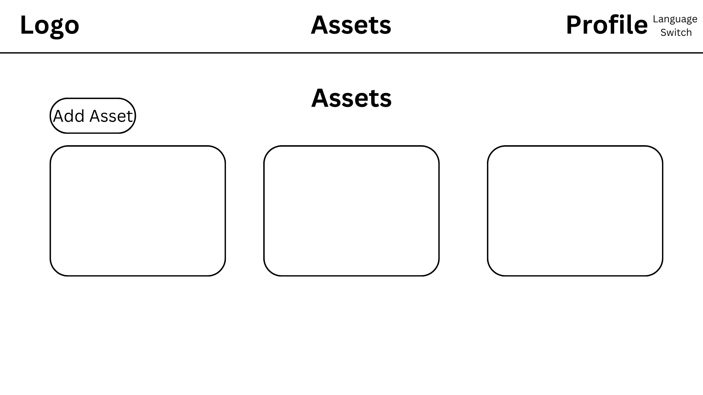
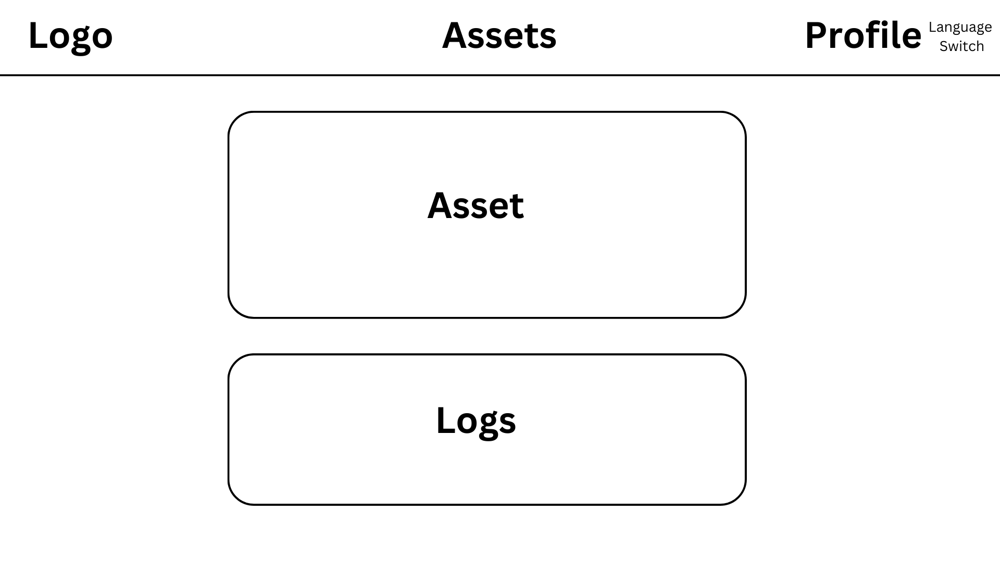
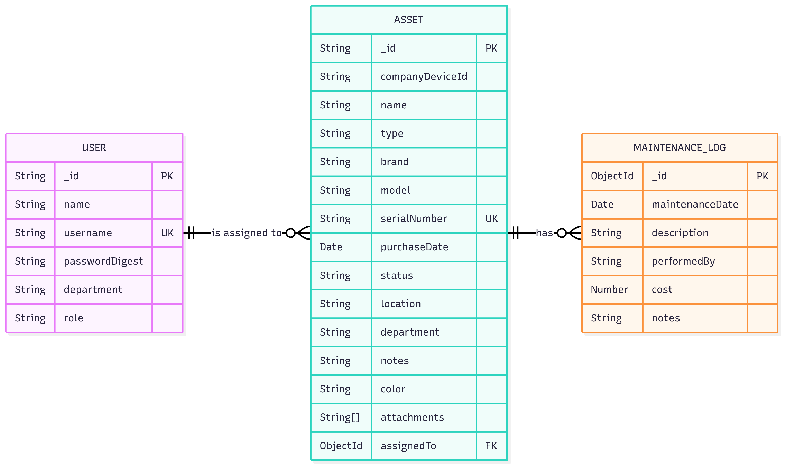

# Assetrack - Asset Tracking App

## App Name & Purpose

**AsseTrack** is a full-stack asset management application designed to help companies track and manage their physical assets and their maintenance history. The app provides a clear and intuitive dashboard for both **Admins** and **Employees**, ensuring that all company assets are accounted for and properly maintained.

The project was developed to demonstrate proficiency in building a comprehensive MERN-stack application, focusing on secure user authentication, role-based authorization, and efficient data management.

---

## Getting Started

To get the application up and running, follow these links:

* **Deployed App:** [Link to your deployed frontend application]
### **Planning & Documentation**
### User Stories
[Click here to read User Stories](./User_Stories.txt)
## Wireframes

### ERD

* **Backend Repository:** [Link to backend repository](https://github.com/GLJ20/asset-tracking-be)

---

## Technologies Used

* **Frontend:** React.js
* **Styling:** CSS, Material-UI
* **State Management:** React Hooks
* **Networking:** Axios
* **Package Manager:** npm

---

## Next Steps

* **Advanced Search & Filtering:** Add robust search functionality to find assets by name, type, or serial number.
* **User Management Panel:** Build a dedicated interface for admins to **create, edit, and delete user accounts**.
* **Notifications:** Implement a notification system for upcoming maintenance dates.
* **Reporting:** Create reports for asset status, maintenance costs, and other key metrics.

---

## Attributions

* **UI Framework:** Material-UI
* **Hosting:** Vercel
